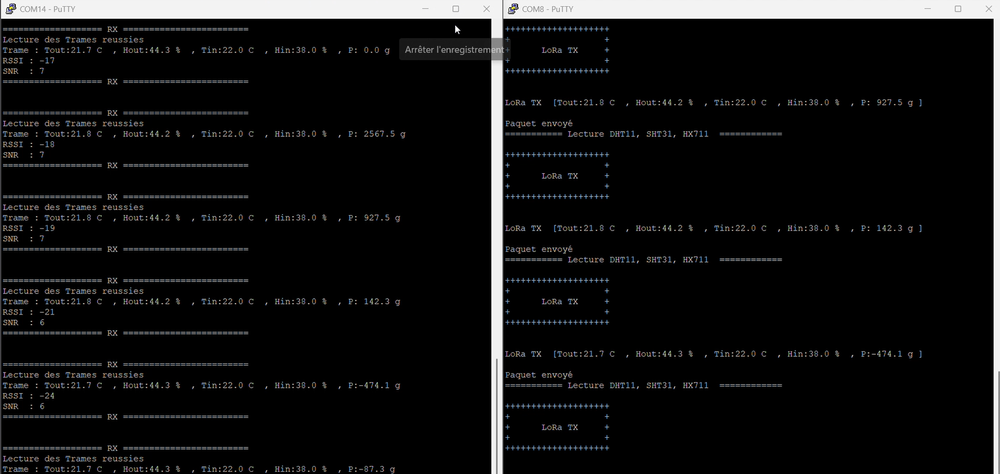
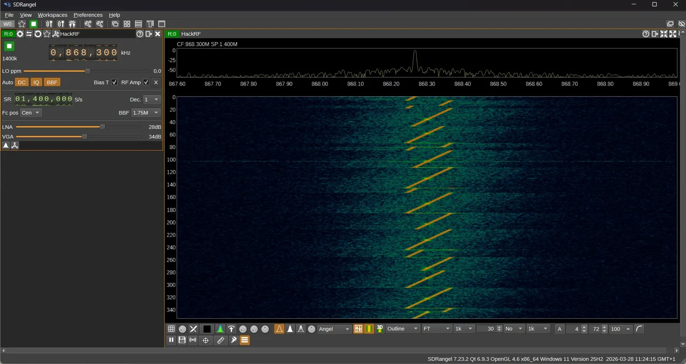

# STM32_2026_G25
Réalisation des systèmes BE

# Ruche Connectée — STM32L476RG

Auteur AGAMA Justin et 

Encadré par : 

Projet de bureau d'étude embarqué sur **STM32L476RG** (HAL). Le système surveille en temps réel l'état d'une ruche via plusieurs capteurs, affiche les données localement sur un écran LCD RGB, et les transmet sans fil par **LoRa P2P** à une unité de réception distante.

---

## Description du problème

La surveillance d'une ruche d'abeilles nécessite le suivi de plusieurs grandeurs physiques critiques pour la santé de la colonie :

- **Température et humidité extérieures** — conditions ambiantes autour de la ruche
- **Température et humidité intérieures** — micro-climat de la colonie (la ruche maintient ~35 °C en permanence)
- **Poids de la ruche** — indicateur direct de la production de miel et de la détection d'essaimage

Ces données sont collectées par le **STM32 émetteur** (côté ruche), affichées sur un LCD local, puis transmises via **LoRa 868 MHz** à un **STM32 récepteur** (côté base) qui les affiche à son tour.

---

## 📁 Architecture du dépôt

```
.
├── Application/
│   ├── inc/                  # En-têtes du projet principal
│   │   ├── main.h
│   │   ├── dht11.h
│   │   ├── sht31.h
│   │   ├── hx711.h
│   │   ├── lib_lcd.h
│   │   ├── LoRa_E5_P2P.h
│   │   ├── gpio.h
│   │   ├── i2c.h
│   │   ├── tim.h
│   │   └── usart.h
│   └── src/                  # Sources du projet principal
│       ├── mainTX.c          # Programme principal — STM32 émetteur (ruche)
│       ├── mainRx.c          # Programme principal — STM32 récepteur (base)
│       ├── dht11.c
│       ├── sht31.c
│       ├── hx711.c
│       ├── lib_lcd.c
│       ├── LoRa_E5_P2P.c
│       ├── gpio.c
│       ├── i2c.c
│       ├── tim.c
│       └── usart.c
│
├── capteurs/
│   ├── DHT11/                # Capteur température & humidité extérieure (Single-Wire)
│   │   ├── dht11.c
│   │   ├── dht11.h
│   │   └── Rapport_DHT11.docx
│   ├── SHT31/                # Capteur température & humidité intérieure (I2C)
│   │   ├── sht31.c
│   │   ├── sht31.h
│   │   └── README.md
│   └── HX711/                # Capteur de poids — jauge de contrainte (GPIO bit-bang)
│       ├── hx711.c
│       ├── hx711.h
│       └── README.md
│
├── LCD/                      # Driver afficheur LCD RGB Grove (I2C)
│   ├── lib_lcd.c
│   └── lib_lcd.h
│
├── LoRa E5/
│   ├── P2P/                  # Mode Point à Point — testé et fonctionnel
│   │   ├── LoRa_E5_P2P.c
│   │   ├── LoRa_E5_P2P.h
│   │   └── Rapport_LoRa_P2P.docx
│   └── LoRaWAN/              # Mode LoRaWAN — code rédigé, non testé
│       ├── LoRa_E5_WAN.c
│       └── LoRa_E5_WAN.h
│
└── README.md
```

---

## Matériel requis

| Composant | Quantité | Rôle |
|---|---|---|
| STM32L476RG (Nucleo-L476RG) | 2 | MCU émetteur (ruche) + récepteur (base) |
| DHT11 | 1 | Température & humidité extérieures |
| SHT31 | 1 | Température & humidité intérieures |
| HX711 + cellule de charge | 1 | Poids de la ruche |
| Grove LCD RGB 16×2 | 2 | Affichage local (émetteur et récepteur) |
| Grove LoRa-E5-HF | 2 | Communication LoRa 868 MHz |

---

## Configuration STM32CubeIDE

### Cible MCU
**STM32L476RGTx** — Nucleo-L476RG

### Périphériques à activer

| Périphérique | Usage | Paramètres |
|---|---|---|
| `USART2` | Debug — printf série | 115200 baud, 8N1 |
| `UART4` | Communication LoRa-E5 | 9600 baud, 8N1 — IT RX activée |
| `I2C1` | SHT31 + LCD Grove | Standard mode 100 kHz |
| `TIM6` | Délais µs (DHT11) | Prescaler → 1 MHz (1 tick = 1 µs) |

### Brochage complet

| Broche STM32 | Périphérique | Signal |
|---|---|---|
| `PA9` | DHT11 | DATA (Single-Wire, open-drain) |
| `PA8` | HX711 | DT (Data) |
| `PB10` | HX711 | SCK (Clock) |
| `I2C1 SDA/SCL` | SHT31 + LCD | SHT31 : 0x44 — LCD : 0x3E |
| `UART4 TX/RX` | LoRa-E5 | Commandes AT |
| `USART2 TX` | PC — debug | printf via ST-Link |

> ⚠️ TIM6 doit être configuré avec un prescaler tel que la fréquence soit **exactement 1 MHz** pour que `Delay_us()` soit précis.

---

## Utilisation des drivers

### DHT11 — Température & humidité extérieure

```c
#include "dht11.h"

// Dans main() — après HAL_TIM_Base_Start(&htim6)
uint8_t temperature = 0, humidity = 0;

DHT11_ReadData(&humidity, &temperature);

printf("Temp ext: %d C  Hum ext: %d %%\r\n", temperature, humidity);
```

> Le timer TIM6 doit être démarré (`HAL_TIM_Base_Start`) avant tout appel DHT11.

---

### SHT31 — Température & humidité intérieure

```c
#include "sht31.h"

SHT31_t sensor;

// Initialisation (une seule fois)
if (SHT31_Init(&sensor, &hi2c1) != HAL_OK) {
    Error_Handler();
}

// Lecture dans la boucle
if (SHT31_ReadTempHum(&sensor)) {
    printf("Temp int: %.1f C  Hum int: %.1f %%\r\n",
           sensor.temperature, sensor.humidity);
}
```

---

### HX711 — Poids de la ruche

```c
#include "hx711.h"

HX711_t balance;

// Initialisation (DT=PA8, SCK=PB10)
HX711_Init(&balance, GPIOA, GPIO_PIN_8, GPIOB, GPIO_PIN_10);
balance.coefficient = 420.5f;  // Valeur de calibration — à adapter

// Tare obligatoire à vide au démarrage
HX711_Tare(&balance, 10);

// Lecture dans la boucle
float poids = HX711_GetWeight(&balance, 5);
printf("Poids: %.1f g\r\n", poids);
```

> `coefficient` est spécifique à chaque cellule de charge.
> **Calibration :** poser un poids connu → lire via `HX711_ReadAverage()` → `coefficient = valeur_brute / poids_connu_g`.

---

### LCD Grove RGB — Affichage local

```c
#include "lib_lcd.h"

LCD_RGB_HandleTypeDef lcd;

// Initialisation
LCD_RGB_Init(&lcd, &hi2c1, 16, 2);
LCD_Clear(&lcd);

// Couleur de fond
LCD_SetCouleur(&lcd, COULEUR_VERT);   // ROUGE / BLEU / BLANC disponibles

// Affichage ligne 0
LCD_SetCursor(&lcd, 0, 0);
LCD_EcrireTexte(&lcd, "Temp: 22.0 C");

// Affichage ligne 1
LCD_SetCursor(&lcd, 0, 1);
LCD_EcrireTexte(&lcd, "Hum : 44.0 %");
```

> Le driver détecte automatiquement la version du contrôleur RGB (adresse 0x62 ou 0x30).

---

### LoRa-E5 — Émission P2P (côté ruche)

```c
#include "LoRa_E5_P2P.h"

LORA_Handle_t  lora;
LORA_Handle_t *lora_handles[] = { &lora };  // Requis par le callback IT UART

char payload[100];

// Initialisation
LORA_Init(&lora, &huart4);
LORA_TestAT(&lora);
LORA_P2P_SetMode(&lora);   // AT+MODE=TEST
LORA_P2P_Config(&lora);    // AT+TEST=RFCFG,868.3,SF12,125,8,8,20,ON,OFF,OFF

// Envoi dans la boucle
snprintf(payload, sizeof(payload),
         "Tout:%.1f, Hout:%.1f, Tin:%.1f, Hin:%.1f, P:%.1f",
         t_ext, h_ext, t_int, h_int, poids);

if (LORA_P2P_SendString(&lora, payload) == LORA_STATUS_OK) {
    printf("Paquet envoye\r\n");
}
```

---

### LoRa-E5 — Réception P2P (côté base)

```c
#include "LoRa_E5_P2P.h"

LORA_Handle_t  lora;
LORA_Handle_t *lora_handles[] = { &lora };  // Requis par le callback IT UART

LORA_P2P_Packet_t packet;

// Initialisation + mise en écoute
LORA_Init(&lora, &huart4);
LORA_TestAT(&lora);
LORA_P2P_StartRX(&lora);

// Boucle principale
while (1) {
    if (LORA_P2P_Available(&lora)) {
        if (LORA_P2P_Read(&lora, &packet) == LORA_STATUS_OK) {
            printf("Recu : %s\r\n", packet.payload);
            printf("RSSI : %d dBm\r\n", packet.rssi);
            printf("SNR  : %d dB\r\n",  packet.snr);
        }
        // Réarmer la réception
        LORA_P2P_StartRX(&lora);
    }
}
```

---

## 📡 Démonstration

### Double terminal — Émetteur (droite) et Récepteur (gauche)



Les deux STM32 fonctionnent en simultané. Chaque trame envoyée côté émetteur est immédiatement reçue et décodée côté récepteur, avec affichage du **RSSI** et du **SNR** mesurés.

---

### Sniff RF à 868 MHz — HackRF + SDRangel



Capture SDRangel avec un **HackRF One** en réception passive. Le waterfall montre les **chirps LoRa SF12** caractéristiques — chaque diagonale montante (jaune/orange) est un up-chirp de la modulation CSS (Chirp Spread Spectrum). Chaque trame correspond à un cycle d'envoi de la ruche, centré sur **868,3 MHz**.

**Configuration SDRangel pour reproduire cette capture :**

| Paramètre | Valeur |
|---|---|
| Récepteur | HackRF One |
| Fréquence centrale | 868,300 MHz |
| Sample rate | 1 400 000 S/s |
| Span affiché | 1,400 MHz |
| LNA gain | 28 dB |
| VGA gain | 34 dB |
| BBF | 1,75 M |
| Mode waterfall | Outline |

---

## Documentation technique

| Module | Documentation |
|---|---|
| DHT11 | `capteurs/DHT11/Rapport_DHT11.docx` — Rapport complet (protocole single-wire, code commenté) |
| SHT31 | `capteurs/SHT31/README.md` |
| HX711 | `capteurs/HX711/README.md` |
| LoRa-E5 P2P | `LoRa E5/P2P/Rapport_LoRa_P2P.docx` — Rapport complet (commandes AT, driver, résultats) |


